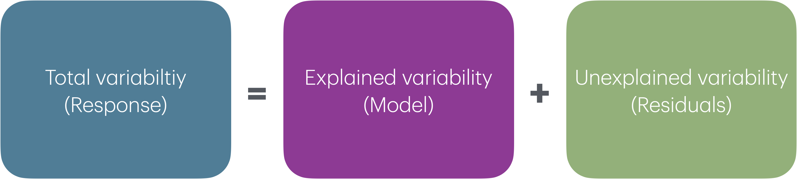

```{r}
#| include: false

# figure options
knitr::opts_chunk$set(
  fig.width = 10, fig.asp = 0.618,
  fig.retina = 3, dpi = 300, fig.align = "center"
)
```

## Announcements

-   Lab 05 due Thursday at 11:59pm

-   HW 03 due Tuesday, March 17 at 11:59pm

-   Statistics experience due April 15

-   Please provide mid-semester feedback by Friday: <https://duke.qualtrics.com/jfe/form/SV_3lvkRQbz7PMuJVA>

## Topics

::: nonincremental
-   Root mean square error
-   ANOVA for multiple linear regression and sum of squares
-   Comparing models with $Adj. R^2$
-   Occam's razor and parsimony
-   Cross validation
:::

## Computational setup

```{r}
#| echo: true

# load packages
library(tidyverse)
library(tidymodels)
library(patchwork)
library(knitr)
library(kableExtra)

# set default theme and larger font size for ggplot2
ggplot2::theme_set(ggplot2::theme_bw(base_size = 20))
```

# Introduction

## Data: Restaurant tips

Which variables help us predict the amount customers tip at a restaurant? To answer this question, we will use data collected in 2011 by a student at St. Olaf who worked at a local restaurant.

```{r}
#| echo: false
#| message: false
tips <- read_csv(here::here("slides", "data/tip-data.csv")) |>
  filter(!is.na(Party))
```

```{r}
#| echo: false
tips |>
  select(Tip, Party, Meal, Age)
```

## Variables

**Predictors**:

::: nonincremental
-   `Party`: Number of people in the party
-   `Meal`: Time of day (Lunch, Dinner, Late Night)
-   `Age`: Age category of person paying the bill (Yadult, Middle, SenCit)
-   `Payment`: Payment type (Cash, Credit, Credit/CashTip)
:::

**Response**: `Tip`: Amount of tip

## Response: `Tip`

```{r}
#| echo: false
ggplot(tips, aes(x = Tip)) +
  geom_histogram(binwidth = 1, fill = "steelblue", color = "black") +
  labs(title = "Distribution of tips")
```

## Predictors

```{r}
#| echo: false
p1 <- ggplot(tips, aes(x = Party)) +
  geom_histogram(binwidth = 1, color = "black", fill = "steelblue") +
  labs(title = "Number of people in party")

p2 <- ggplot(tips, aes(x = Meal)) +
  geom_bar(color = "black", fill = "steelblue") +
  labs(title = "Meal type")

p3 <- ggplot(tips, aes(x = Age)) +
  geom_bar(color = "black", fill = "steelblue") +
  labs(title = "Age of payer")

p1 + (p2 / p3)
```

## Relevel categorical predictors

```{r}
#| echo: true

tips <- tips |>
  mutate(
    Meal = fct_relevel(Meal, "Lunch", "Dinner", "Late Night"),
    Age  = fct_relevel(Age, "Yadult", "Middle", "SenCit")
  )
```

## Predictors, again

```{r}
#| echo: false
p1 <- ggplot(tips, aes(x = Party)) +
  geom_histogram(binwidth = 1,color = "black", fill = "steelblue") +
  labs(title = "Number of people in party")

p2 <- ggplot(tips, aes(x = Meal, fill = Meal)) +
  geom_bar() +
  labs(title = "Meal type") +
  scale_fill_viridis_d(end = 0.8)

p3 <- ggplot(tips, aes(x = Age, fill = Age)) +
  geom_bar() +
  labs(title = "Age of payer") +
  scale_fill_viridis_d(option = "E", end = 0.8)

p1 + (p2 / p3)

```

## Response vs. predictors

```{r}
#| echo: false
#| fig.width: 12
#| fig.height: 4

p4 <- ggplot(tips, aes(x = Party, y = Tip)) +
  geom_point(color = "#5B888C")

p5 <- ggplot(tips, aes(x = Meal, y = Tip, fill = Meal)) +
  geom_boxplot(show.legend = FALSE) +
  scale_fill_viridis_d(end = 0.8)

p6 <- ggplot(tips, aes(x = Age, y = Tip, fill = Age)) +
  geom_boxplot(show.legend = FALSE) +
  scale_fill_viridis_d(option = "E", end = 0.8)

p4 + p5 + p6
```

## Fit and summarize model {.midi}

```{r}
#| echo: true

tip_fit <- lm(Tip ~ Party + Age, data = tips)

tidy(tip_fit) |>
  kable(digits = 3)
```

. . .

<br>

::: question
Is this a useful model? How well does this model perform?
:::

## RMSE

$$
RMSE = \sqrt{\frac{\sum_{i=1}^n(y_i - \hat{y}_i)^2}{n}} = \sqrt{\frac{\sum_{i=1}^ne_i^2}{n}}
$$

::: incremental
-   Ranges between 0 (perfect predictor) and infinity (terrible predictor)

-   Same units as the response variable

-   The value of RMSE is more useful for comparing across models than evaluating a single model
:::

## Analysis of variance (ANOVA)

**Analysis of Variance (ANOVA)**: Technique to partition variability in Y by the sources of variability

{fig-align="center"}

## ANOVA

-   **Main Idea:** Decompose the total variation in the response into
    -   the variation that can be explained by the each of the variables in the model

    -   the variation that **can't** be explained by the model (left in the residuals)
-   If the variation that can be explained by the variables in the model is greater than the variation in the residuals, this signals that the model might be "valuable" (at least one of the $\beta$'s not equal to 0)

## Sum of Squares

<br>

$$
\begin{aligned}
\color{#407E99}{SST} \hspace{5mm}&= &\color{#993399}{SSM} &\hspace{5mm} +  &\color{#8BB174}{SSR} \\[10pt]
\color{#407E99}{\sum_{i=1}^n(y_i - \bar{y})^2} \hspace{5mm}&= &\color{#993399}{\sum_{i = 1}^{n}(\hat{y}_i - \bar{y})^2} &\hspace{5mm}+ &\color{#8BB174}{\sum_{i = 1}^{n}(y_i - \hat{y}_i)^2}
\end{aligned}
$$

## $R^2$

The **coefficient of determination** $R^2$ is the proportion of variation in the response, $Y$, that is explained by the regression model

. . .

$$
R^2 = \frac{SSM}{SST} = 1 - \frac{SSR}{SST} = 1 - \frac{686.44}{1913.11} = 0.641
$$

# Model comparison

## Two potential models

Let's consider two models:

-   Model 1: `Party`, `Age`
-   Model 2: `Party`, `Age`, `Payment`

. . .

<center><b> Which model is a better fit for the data? </b></center>

## Limitation of $R^2$

<br>

When we add a predictor to a model:

-   The residual sum of squares (SSR) can only decrease (or stay the same)
-   Therefore, $R^2$ can only increase (or stay the same)

## Why can't we soley rely on $R^2$?

::::: panel-tabset
## Question

:::: midi
::: question
Why can’t we rely solely on $R^2$ for model comparison?
:::

🔗 <https://forms.office.com/r/ZWQEhqkcRX>
::::

## Submit

```{=html}
<center><iframe width="640px" height="480px" src="https://forms.office.com/r/ZWQEhqkcRX?embed=true" frameborder="0" marginwidth="0" marginheight="0" style="border: none; max-width:100%; max-height:100vh" allowfullscreen webkitallowfullscreen mozallowfullscreen msallowfullscreen> </iframe></center>
```
:::::

## Limitation of $R^2$

<br>

If we choose models based only on $R^2$:

-   We will always prefer models with more predictors\
-   Even if those predictors add little real value

We need a measure that balances model fit and model complexity

## Adjusted $R^2$

Adjusted $R^2$ penalizes for unncessary predictors

$$Adj. R^2 = 1 - \frac{SSR/(n-p-1)}{SST/(n-1)}$$

where

-   $n$ is the number of observations used to fit the model

-   $p$ is the number of terms (not including the intercept) in the model

## Comparing models with $Adj. R^2$ {.midi}

::::: columns
::: {.column width="50%"}
```{r}
#| echo: true

tip_fit_1 <- lm(Tip ~ Party + Age , 
    data = tips)

glance(tip_fit_1) |> 
  select(r.squared, adj.r.squared)
```
:::

::: {.column width="50%"}
```{r}
#| echo: true

tip_fit_2 <- lm(Tip ~ Party + Age + Payment, 
      data = tips)

glance(tip_fit_2) |> 
  select(r.squared, adj.r.squared)
```
:::
:::::

<br>

::: question
2.  Which model would we choose based on $R^2$?
3.  Which model would we choose based on Adjusted $R^2$?
:::

## Model comparison and evaluation

-   Adjusted $R^2$ can be used to compare models

-   $R^2$ describes how much variability in the response is explained by the predictors

-   RMSE can be used to compare models and describe predictive performance

## Parsimony and Occam's razor {.small}

-   The principle of **parsimony** is attributed to William of Occam (early 14th-century English nominalist philosopher), who insisted that, given a set of equally good explanations for a given phenomenon, *the correct explanation is the simplest explanation*[^1]

-   Called **Occam's razor** because he "shaved" his explanations down to the bare minimum

-   Parsimony in modeling:

    ::: nonincremental
    -   models should have as few parameters as possible
    -   linear models should be preferred to non-linear models
    -   experiments relying on few assumptions should be preferred to those relying on many
    -   models should be pared down until they are *minimal adequate*
    -   simple explanations should be preferred to complex explanations
    :::

[^1]: Source: The R Book by Michael J. Crawley.

## In pursuit of Occam's razor

-   Occam's razor states that among competing hypotheses that predict equally well, the one with the fewest assumptions should be selected

-   Model selection follows this principle

-   We only want to add another variable to the model if the addition of that variable brings something valuable in terms of predictive power to the model

-   In other words, we prefer the simplest best model, i.e. **parsimonious** model

## Alternate views {.midi}

> Sometimes a simple model will outperform a more complex model . . . Nevertheless, I believe that deliberately limiting the complexity of the model is not fruitful when the problem is evidently complex. Instead, if a simple model is found that outperforms some particular complex model, the appropriate response is to define a different complex model that captures whatever aspect of the problem led to the simple model performing well.
>
> <br>
>
> Radford Neal - Bayesian Learning for Neural Networks[^2]

[^2]: Suggested blog post: [Occam](https://statmodeling.stat.columbia.edu/2012/06/26/occam-2/) by Andrew Gelman

## Why parsimony matters

Potential issues with overly complex models:

-   Can overfit the data\
-   May not generalize well to new observations\
-   Are harder to interpret

# Evaluating models with training and testing sets

## Training vs. testing sets {.midi}

::: incremental
-   The training set (i.e., the data used to fit the model) does not have the capacity to be a good arbiter of performance.

-   It is not an independent piece of information; predicting the training set can only reflect what the model already knows.

-   Suppose you give a class a test, then give them the answers, then provide the same test. The student scores on the second test do not accurately reflect what they know about the subject; these scores would probably be higher than their results on the first test.

-   We can reserve some data for a testing set that can be used to evaluate the model performance
:::

## Training and testing sets {.midi}

Create training and testing sets using functions from the **resample** R package (part of **tidymodels**)

**Step 1:** Create an initial split:

```{r}
set.seed(210)
tips_split <- initial_split(tips, prop = 0.75) #prop = 3/4 by default
```

. . .

**Step 2:** Save training data

```{r}
tips_train <- training(tips_split)
dim(tips_train)
```

. . .

**Step 3:** Save testing data

```{r}
tips_test <- testing(tips_split)
dim(tips_test)
```

# Application exercise

::: appex
📋 [sta210-sp26.github.io/ae/ae-09-model-compare.html](../ae/ae-09-model-compare.html)
:::

## Recap

-   ANOVA for multiple linear regression and sum of squares
-   Comparing models with
    -   $R^2$ vs. $Adj. R^2$
    -   AIC and BIC
-   Occam's razor and parsimony
-   Training and testing data

## Next class

-   Cross validation

-   Complete [Lecture 15 prepare](../prepare-lec15.html)
