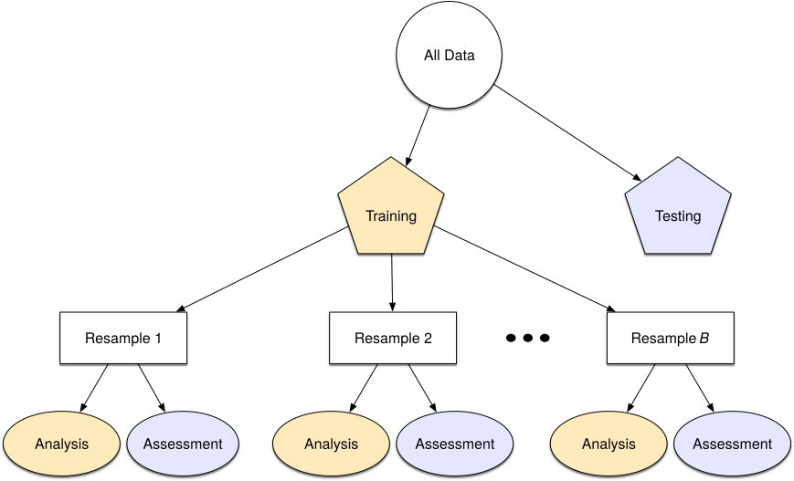
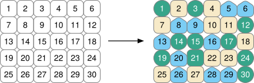

```{r}
#| include: false

# figure options
knitr::opts_chunk$set(
  fig.width = 10, fig.asp = 0.618,
  fig.retina = 3, dpi = 300, fig.align = "center"
)
```

## Announcements  {.midi}

-   Lab 05 due TODAY at 11:59pm

-   HW 03 due Tuesday, March 17 at 11:59pm

-   Statistics experience due April 15

-   Please provide mid-semester feedback by Friday: <https://duke.qualtrics.com/jfe/form/SV_3lvkRQbz7PMuJVA>

-   Exam 02 date proposed date change

    -   In-class: Thursday, April 9

    -   Take-home: Thursday, April 9 - Saturday, April 11

    -   Please email me [by tomorrow]{.underline} if you have any concerns

## Topics

::: nonincremental
-   Training and testing sets
-   Cross validation
:::

## Computational setup

```{r}
#| echo: true

# load packages
library(tidyverse)
library(tidymodels)
library(patchwork)
library(knitr)
library(kableExtra)

# set default theme and larger font size for ggplot2
ggplot2::theme_set(ggplot2::theme_bw(base_size = 20))
```

# Data: Restaurant tips

Which variables help us predict the amount customers tip at a restaurant? To answer this question, we will use data collected in 2011 by a student at St. Olaf who worked at a local restaurant.

```{r}
#| echo: false
#| message: false
tips <- read_csv(here::here("slides", "data/tip-data.csv")) |>
 mutate(
    Meal = fct_relevel(Meal, "Lunch", "Dinner", "Late Night"),
    Age  = fct_relevel(Age, "Yadult", "Middle", "SenCit")
  )
```

```{r}
#| echo: false
tips |>
  select(Tip, Party, Meal, Age)
```

## Variables

**Predictors**:

::: nonincremental
-   `Party`: Number of people in the party
-   `Meal`: Time of day (Lunch, Dinner, Late Night)
-   `Age`: Age category of person paying the bill (Yadult, Middle, SenCit)
-   `Payment`: Payment type (Cash, Credit, Credit/CashTip)
:::

## Response vs. predictors

```{r}
#| echo: false
#| fig.width: 12
#| fig.height: 4

p4 <- ggplot(tips, aes(x = Party, y = Tip)) +
  geom_point(color = "#5B888C")

p5 <- ggplot(tips, aes(x = Meal, y = Tip, fill = Meal)) +
  geom_boxplot(show.legend = FALSE) +
  scale_fill_viridis_d(end = 0.8)

p6 <- ggplot(tips, aes(x = Age, y = Tip, fill = Age)) +
  geom_boxplot(show.legend = FALSE) +
  scale_fill_viridis_d(option = "E", end = 0.8)

p4 + p5 + p6
```

## Training vs. testing sets {.midi}

-   The training set (i.e., the data used to fit the model) does not have the capacity to be a good arbiter of performance.

-   It is not an independent piece of information; predicting the training set can only reflect what the model already knows.

-   Suppose you give a class a test, then give them the answers, then provide the same test. The student scores on the second test do not accurately reflect what they know about the subject; these scores would probably be higher than their results on the first test.

-   We can reserve some data for a testing set that can be used to evaluate the model performance

## Training and testing sets {.midi}

Create training and testing sets using functions from the **resample** R package (part of **tidymodels**)

**Step 1:** Create an initial split:

```{r}
set.seed(210)
tips_split <- initial_split(tips, prop = 0.75) #prop = 3/4 by default
```

**Step 2:** Save training data

```{r}
tips_train <- training(tips_split)
dim(tips_train)
```

**Step 3:** Save testing data

```{r}
tips_test <- testing(tips_split)
dim(tips_test)
```

# Application exercise

::: appex
📋 [sta210-sp26.github.io/ae/ae-09-model-compare.html](../ae/ae-09-model-compare.html)
:::

# Cross validation

## Spending our data

-   We have already established that the idea of data spending where the test set was recommended for obtaining an unbiased estimate of performance.
-   However, we usually need to understand the effectiveness of the model [*before*]{.underline} *using the test set*.
-   Typically we can't decide on *which* final model to take to the test set without making model assessments.
-   **Remedy:** Resampling to make model assessments on training data in a way that can generalize to new data.

## Resampling for model assessment

**Resampling is only conducted on the** <u>**training**</u> **set**. The test set is not involved. For each iteration of resampling, the data are partitioned into two subsamples:

-   The model is fit with the **analysis set**. Model fit statistics such as Adj. $R^2$ and $R^2$ are computed based on this model fit.
-   The model is evaluated with the **assessment set**.

## Resampling for model assessment

{fig-align="center"}

<br>

Image source: Kuhn and Silge. [Tidy modeling with R](https://www.tmwr.org/).

## Analysis and assessment sets

-   Analysis set is analogous to training set.
-   Assessment set is analogous to test set.
-   The terms *analysis* and *assessment* avoids confusion with initial split of the data.
-   These data sets are mutually exclusive.

## Cross validation

More specifically, **v-fold cross validation** -- commonly used resampling technique:

-   Randomly split your **training** **data** into ***v*** partitions
-   Use ***v-1*** partitions for analysis, and the remaining 1 partition for analysis (model fit + model fit statistics)
-   Repeat ***v*** times, updating which partition is used for assessment each time

. . .

Let's give an example where `v = 3`...

## To get started...

**Split data into training and test sets**

```{r}
#| echo: true
#| 
set.seed(210)
tips_split <- initial_split(tips, prop = 0.75)
tips_train <- training(tips_split)
tips_test <- testing(tips_split)
```

## To get started... {.midi}

**Specify model**

```{r}
#| echo: true
tips_spec <- linear_reg()
```

<br>

. . .

```{r}
tips_spec
```

## To get started...

**Create workflow**

```{r}
#| echo: true
tips_wflow1 <- workflow() |>
  add_model(tips_spec) |>
  add_formula(Tip ~ Age + Party)
```

. . .

```{r}
tips_wflow1
```

## Cross validation, step 1

Randomly split your **training** **data** into 3 partitions:

<br>

{fig-align="center"}

## Tips: Split training data

```{r}
#| echo: true
folds <- vfold_cv(tips_train, v = 3)
folds
```

## Cross validation, steps 2 and 3

::: nonincremental
-   Use *v-1* partitions for analysis, and the remaining 1 partition for assessment
-   Repeat *v* times, updating which partition is used for assessment each time
:::

{fig-align="center"}

## Cross validation: Tips data

::::: panel-tabset
## Question

:::: midi
::: question
There are 126 observations in the training data. How many observations are in a single **assessment** set?
:::

🔗 <https://forms.office.com/r/n5wYDEKnFX>
::::

## Submit

```{=html}
<center><iframe width="640px" height="480px" src="https://forms.office.com/r/n5wYDEKnFX?embed=true" frameborder="0" marginwidth="0" marginheight="0" style="border: none; max-width:100%; max-height:100vh" allowfullscreen webkitallowfullscreen mozallowfullscreen msallowfullscreen> </iframe></center>
```
:::::

## 

## Tips: Fit resamples {.midi}

```{r}
tips_fit_rs1 <- tips_wflow1 |>
  fit_resamples(resamples = folds)

tips_fit_rs1
```

## Cross validation, now what?

-   We've fit a bunch of models
-   Now it's time to use them to collect metrics (e.g., RMSE, $R^2$ ) on each model and use them to evaluate model fit and how it varies across folds

## Collect metrics from CV

```{r}
# Produces summary across all CV
collect_metrics(tips_fit_rs1)
```

<br>

Note: These are calculated using the *assessment* data

## Deeper look into results

```{r}
cv_metrics1 <- collect_metrics(tips_fit_rs1, summarize = FALSE) 

cv_metrics1
```

## Better presentation of results

```{r}
cv_metrics1 |>
  mutate(.estimate = round(.estimate, 3)) |>
  pivot_wider(id_cols = id, names_from = .metric, values_from = .estimate) |>
  kable(col.names = c("Fold", "RMSE", "R-sq"))
```

## Cross validation in practice

::: incremental
-   To illustrate how CV works, we used `v = 3`:

    ::: nonincremental
    -   Analysis sets are 2/3 of the training set
    -   Each assessment set is a distinct 1/3
    -   The final resampling estimate of performance averages each of the 3 replicates
    :::

-   This was useful for illustrative purposes, but `v` is often 5 or 10; we generally prefer 10-fold cross-validation as a default
:::

## Example model selection workflow

-   Exploratory data analysis

-   Using training data...

    -   Fit and evaluate candidate models using cross validation

    -   Select the best fit model

    -   Check model conditions and diagnostics

    -   Repeat as needed until you've landed on final model

-   Evaluate the final model performance using the test set

::: callout-tip
See [Section 10.5.2](https://intro-regression.github.io/10-model-eval.html#cross-validation-1) for more detailed workflow
:::

## Data analysis workflow


## Recap

-   Training and testing sets
-   Cross validation

## Next class

☀️ Have a good spring break ☀️
