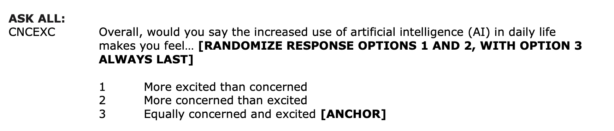

```{r}
#| include: false

# figure options
knitr::opts_chunk$set(
  fig.width = 10, fig.asp = 0.618, out.width = "90%",
  fig.retina = 3, dpi = 300, fig.align = "center"
)

library(countdown)
```

```{webr-r}
#| context: setup

heart_disease <- read_csv("data/framingham.csv") |>
  select(age, totChol, TenYearCHD, currentSmoker) |>
  drop_na() |>
  mutate(high_risk = as_factor(TenYearCHD), 
         currentSmoker = as_factor(currentSmoker))

heart_disease_fit <- glm(high_risk ~ age + totChol + currentSmoker, 
              data = heart_disease, family = "binomial")
```

## Announcements {.midi}

-   Project EDA due March 24 at 11:59pm (on GitHub)

-   Statistics experience due April 15

**Submit questions by the end of the day. Form at the end of today’s notes.**

## Topics

-   Interpreting logistic regression models

-   Relationship between odds and probabilities

-   Odds ratios

## Computational setup

```{r}
#| warning: false

# load packages
library(tidyverse)
library(tidymodels)
library(knitr)
library(patchwork)
library(ggridges) # for ridgeline plots
library(RColorBrewer)

# set default theme in ggplot2
ggplot2::theme_set(ggplot2::theme_bw())
```

## Data: Concern about rising AI {.midi}

```{r}
#| echo: false
pew_data <- read_csv("data/pew-atp-w132.csv")
```

This data comes from the 2023 [Pew Research Center's American Trends Panel](https://www.pewresearch.org/the-american-trends-panel/). The survey aims to capture public opinion about a variety of topics including politics, religion, and technology, among others. We will use data from `r nrow(pew_data)` respondents in Wave 132 of the survey conducted July 31 - August 6, 2023.

<br>

**The goal of this analysis is to understand the relationship between age, time to complete the survey, and concern about the increased use of AI in daily life.**

<br>

A more complete analysis on this topic can be found in the Pew Research Center article [*Growing public concern about the role of artificial intelligence in daily life*](https://www.pewresearch.org/short-reads/2023/08/28/growing-public-concern-about-the-role-of-artificial-intelligence-in-daily-life/) by Alec Tyson and Emma Kikuchi.

## Variables

-   `ai_concern`: Whether a respondent said they are "more concerned than excited" about in the increased use of AI in daily life (1: yes, 0: no)

{fig-align="center"}

## Variables {.midi}

-   `age_cat`: Age category

    -   18-29
    -   30-49
    -   50-64
    -   65+
    -   Refused

-   `survey_time`: Time to complete the survey (in minutes)

## Data prep

```{r}
# change variable names and recode categories
pew_data <- pew_data |>
  mutate(ai_concern = if_else(CNCEXC_W132 == 2, 1, 0),
         age_cat = case_when(F_AGECAT == 1 ~ "18-29",
                             F_AGECAT == 2 ~ "30-49",
                             F_AGECAT == 3 ~ "50-64",
                             F_AGECAT == 4 ~ "65+",
                             TRUE ~ "Refused"
))

# Make factors and  relevel 
pew_data <- pew_data |>
  mutate(ai_concern = factor(ai_concern),
         age_cat = factor(age_cat))

# compute the time it took to do the interview
pew_data <- pew_data |>
  mutate(
    start_time = ymd_hms(INTERVIEW_START_W132),
    end_time = ymd_hms(INTERVIEW_END_W132),
    survey_time = as.numeric(difftime(end_time, start_time, units = "mins"))
)
  
pew_data <- 
  pew_data |> filter(survey_time <= 70)

```

## Bivariate EDA

```{r}
#| code-fold: true


ggplot(data = pew_data, aes(x = age_cat, fill = ai_concern)) + 
  geom_bar(position = "fill", color = "black") +
  labs(x = "",
       y = "Proportion",
       title = "AI Concern versus Age", 
       fill = "AI Concern") +
  scale_fill_brewer(palette = "Dark2")
```

## Bivariate EDA

```{r}
#| code-fold: true

ggplot(data = pew_data, aes(x = survey_time, y = ai_concern, 
                                  fill = ai_concern)) + 
  geom_density_ridges() +
  theme_ridges() + 
  labs(title = "AI concern versus survey time", 
         x = "Survey time in minutes", 
         y = "AI concern",
       fill = "AI concern") +
  theme(legend.position = "none") +
  scale_fill_brewer(palette = "Dark2") 
```

## Logistic regression model {.incremental}

Let $\pi$ be the probability that $Y = 1$. Then the population-level **logistic regression model** is of the form

$$
\log\big(\frac{\pi}{1-\pi}\big) = \beta_0 + \beta_1~X_1 + \beta_2X_2 + \dots + \beta_p X_p
$$

<br>

where $\log\big(\frac{\pi}{1-\pi}\big)$ = the log odds $Y = 1$

## AI concern versus age

```{r}
#| echo: true
ai_concern_fit <- glm(ai_concern ~ age_cat, data = pew_data, 
                      family = "binomial")

tidy(ai_concern_fit) |> kable(digits = 3)
```

## The model {.midi}

```{r}
#| echo: false
#| label: ai_concern_age_tidy

tidy(ai_concern_fit) |> kable(digits = 3)
```

\
$$\begin{aligned}\log\Big(\frac{\hat{\pi}}{1-\hat{\pi}}\Big) =& -0.248 + 0.126\times\text{age_cat30-49} + 0.538 \times \text{age_cat50-64}\\ 
&+ 0.643 \times \text{age_cat65+} + 0.493\times \text{age_catRefused} \end{aligned}$$

where $\hat{\pi}$ is the predicted probability of being concerned about increased use of AI in daily life

## Interpreting `age_cat30-49`: log-odds

::: small
```{r}
#| ref.label: ai_concern_age_tidy
#| echo: false
```
:::

The predicted **log-odds** of being concerned about increased use of AI in daily life are 0.126 higher for individuals 30 - 49 years old compared to 18-29 year-olds (the baseline group).

. . .

::: callout-warning
We would not use the interpretation in terms of log-odds in practice.
:::

## Interpreting `age_cat30-49`: odds

::: small
```{r}
#| ref.label: heart-edu-tidy
#| echo: false
```
:::

The predicted **odds** of being concerned about increased use of AI in daily life for 30 - 49 year-olds are `r round(exp(0.126), 3)` ( $e^{0.126}$ ) times the odds for 18-29 year-olds.

## Coefficients & odds ratios

The model coefficient, 0.126, is the expected difference in the log-odds when comparing 30 - 49 year olds to 18 - 29 year olds.

. . .

Therefore, $e^{0.126}$ = `r round(exp(0.126),3)` is the expected change in the **odds** when comparing 30 - 49 year olds to 18-29 year olds.

. . .

$$
OR  = e^{\hat{\beta}_j} = \exp\{\hat{\beta}_j\}
$$

## Interpret in terms of percent change

You can also interpret the change in the odds in terms of a percent change. The percent change in the odds can be computed as the following

$$\% \text{ change } = (e^{\hat{\beta}_j} - 1) \times 100$$

<br>

::: question
Interpret the coefficient of `age_cat30-49` (0.126) in terms of the percent change in the odds.
:::

## Quantitative predictor

Now let's look at the relationship between `survey_time` and `ai_concern`

```{r}
ai_time_fit <- glm(ai_concern ~ survey_time, data = pew_data,
family = "binomial")
```

```{r}
#| echo: false
#| label: ai-concern-time-tidy

tidy(ai_time_fit) |>
  kable(digits = 3)
```

. . .

For each additional minute of taking the survey, the predicted odds of being concerned about increased AI in daily life multiply by a factor of `r round(exp(0.005), 3)` ( $e^{0.005}$).

## Multiple predictors

Now let's consider a model that takes into account `age` and `survey_time`

```{r}
ai_concern_full_fit <- glm(ai_concern ~ age_cat  + survey_time, data = pew_data, family = "binomial")
```

## Multiple predictors {.midi}

```{r}
#| echo: false
tidy(ai_concern_full_fit) |> kable(digits = 3)
```

<br>

::: question
-   Describe the type of respondent represented by the intercept.
-   Interpret the coefficient of `survey_time` in the context of the data.
:::

## Displaying logistic model in R

By default, `tidy()` displays the model in terms of $\log\big(\frac{\hat{\pi}}{1 - \hat{\pi}}\big)$ . Use argument `exponentiate = TRUE` to display the model in terms of the odds.

```{r}
tidy(ai_concern_full_fit, exponentiate = TRUE) |>
  kable(digits = 3)
```

# Prediction

## Data: Risk of coronary heart disease

This data set is from an ongoing cardiovascular study on residents of the town of Framingham, Massachusetts.

-   `high_risk`: 1 = High risk of having heart disease in next 10 years, 0 = Not high risk of having heart disease in next 10 years

-   `age`: Age at exam time (in years)

-   `totChol`: Total cholesterol (in mg/dL)

-   `currentSmoker`: 0 = nonsmoker; 1 = smoker

**The goal is to use logistic regression to identify patients who are high risk of heart disease.**

## Univariate EDA

```{r}
#| echo: false
heart_disease <- read_csv("data/framingham.csv") |>
  select(age, totChol, TenYearCHD, currentSmoker) |>
  drop_na() |>
  mutate(high_risk = as_factor(TenYearCHD), 
         currentSmoker = as_factor(currentSmoker))
```

```{r}
#| echo: false

p1 <- ggplot(data = heart_disease, aes(x = high_risk)) + 
  geom_bar(fill = "darkcyan", color = 'black') + 
  labs(x = "High risk")

p2 <- ggplot(data = heart_disease, aes(x = age)) + 
  geom_histogram(fill = "darkcyan",color = 'black', binwidth = 2) + 
  labs(x = "Age")
p3 <- ggplot(data = heart_disease, aes(x = totChol)) + 
  geom_histogram(fill = "darkcyan", color = 'black') + 
  labs(x = "Total Cholesterol")

p4 <- ggplot(data = heart_disease, aes(x = currentSmoker)) + 
  geom_bar(fill = "darkcyan", color = 'black') + 
  labs(x = "Current smoker")

(p1 + p2) / (p3 + p4)
```

## Bivariate EDA

```{r}
#| echo: false

p5 <- ggplot(data = heart_disease, aes(x = high_risk, y = age)) + 
  geom_boxplot(fill = "darkcyan") +
  labs(x = "High risk",
       y = "Age") + 
  coord_flip()

p6 <- ggplot(data = heart_disease, aes(x = currentSmoker, fill = high_risk)) + 
  geom_bar(position = "fill", color = "black") +
  labs(x = "Current smoker", 
       fill = "High risk") + 
  theme(legend.position = "bottom") +
  scale_fill_brewer(palette = "Dark2")

p7 <- ggplot(data = heart_disease, aes(x = high_risk, y = totChol)) + 
  geom_boxplot(fill = "steelblue") +
  labs(x = "High risk",
       y = "Total cholesterol") + 
  coord_flip()

p6 + (p5 / p7) 

```

## Modeling risk of coronary heart disease

```{r}
heart_disease_fit <- glm(high_risk ~ age + totChol + currentSmoker, 
              data = heart_disease, family = "binomial")

tidy(heart_disease_fit) |> 
  kable(digits = 3)
```

## Prediction and classification

::: incremental
-   We are often interested in using the model to classify observations, i.e., predict whether a given observation will have a 1 or 0 response

-   For each observation

    -   Use the logistic regression model to calculate the predicted log-odds the response for the $i^{th}$ observation is 1
    -   Use the log-odds to calculate the predicted probability the $i^{th}$ observation is 1
    -   Then, use the predicted probability to classify the observation as having a 1 or 0 response using some predefined threshold
:::

## Augmented data frame

```{r}
#| echo: true
heart_disease_aug <- augment(heart_disease_fit)
```

```{r}
#| echo: false
heart_disease_aug
```

## Predicted log-odds

```{r}
#| echo: false
heart_disease_aug |> 
  select(.fitted) |> 
  slice(1:5)
```

. . .

**Observation 1**

$$
\log(\hat{\text{odds}}) = \log\Big(\frac{\hat{\pi}}{1- \hat{\pi}}\Big) = -3.06
$$

## Predicted odds

```{r}
#| echo: false
heart_disease_aug |> 
  select(.fitted) |> 
  slice(1:5)
```

. . .

**Observation 1**

$$
\hat{\text{odds}} = \frac{\hat{\pi}}{1- \hat{\pi}} = \exp\{-3.06\} = 0.0469
$$

## Predicted probability

```{r}
#| echo: false
heart_disease_aug |> 
  select(.fitted) |> 
  slice(1:5)
```

. . .

**Observation 1**

$$
\text{predicted prob.} = \hat{\pi} = \frac{\hat{\text{odds}}}{1+\hat{\text{odds}}} = \frac{\exp\{-3.06\}}{1 + \exp\{-3.06\}}= 0.045
$$

## Classifying observations

::::: panel-tabset
## Question

:::: midi
::: question
1.  An individual has a predicted probability of 0.045. Would you consider this person high risk for heart disease?
2.  An individual has a predicted probability of 0.321. Would you consider this person high risk for heart disease?
:::

🔗 <https://forms.office.com/r/VPjCMfrsLy>
::::

## Submit

```{=html}
<center><iframe width="640px" height="480px" src="https://forms.office.com/r/VPjCMfrsLy?embed=true" frameborder="0" marginwidth="0" marginheight="0" style="border: none; max-width:100%; max-height:100vh" allowfullscreen webkitallowfullscreen mozallowfullscreen msallowfullscreen> </iframe></center>
```
:::::

## Predicted probabilities in R

Compute predicted probabilities by adding `type.predict = "response"` argument in `augment()`

<br>

. . .

```{r}
#| echo: true

heart_disease_aug <- augment(heart_disease_fit, type.predict = "response")
```

. . .

**Predicted probabilities for Observations 1 -5**

```{r}
#| echo: false
heart_disease_aug |> select(.fitted) |> head()
```

## Classifying observations

::: question
You would like to determine a threshold for classifying individuals as high risk or not high risk.

What considerations would you make in determining the threshold?
:::

## Classify using 0.5 as threshold

We can use a threshold of 0.5 to classify observations.

-   If $\hat{\pi} > 0.5$, classify as 1

-   If $\hat{\pi} \leq 0.5$, classify as 0

. . .

```{r}
heart_disease_aug <- heart_disease_aug |>
  mutate(pred_class = factor(if_else(.fitted > 0.5, 1, 0)))
```

. . .

```{r}
#| echo: false

heart_disease_aug |>
  select(high_risk, .fitted, pred_class) |>
  slice(1:5)
```

## Confusion matrix

A **confusion matrix** is a $2 \times 2$ table that compares the predicted and actual classes. We can produce this matrix using the `conf_mat()` function in the **yardstick** package (part of tidymodels).

<br>

. . .

```{r}
#| echo: true
heart_disease_aug |>
  conf_mat(high_risk, pred_class) 
```

## Visualize confusion matrix

```{r}
#| echo: true

heart_conf_mat <- heart_disease_aug |>
  conf_mat(high_risk, pred_class)

autoplot(heart_conf_mat, type = "heatmap") 
```

## Using the confusion matrix

::: center
```{r}
#| echo: false

heart_disease_aug |>
  conf_mat(high_risk, pred_class) 
```
:::

<br>

. . .

The **accuracy** of this model with a classification threshold of 0.5 is

$$
\text{accuracy} = \frac{3553 + 0}{3553 + 635 + 2 + 0} = 0.848
$$

## Using the confusion matrix

::: center
```{r}
#| echo: false

heart_disease_aug |>
  conf_mat(high_risk, pred_class) 
```
:::

<br>

. . .

The **misclassification rate** of this model with a threshold of 0.5 is

$$
\text{misclassification} = \frac{635 + 2}{3553 + 635 + 2 + 0} = 0.152
$$

## Using the confusion matrix

::: center
```{r}
#| echo: false

heart_disease_aug |>
  conf_mat(high_risk, pred_class) 
```
:::

<br>

Accuracy is 0.848 and the misclassification rate is 0.152.

. . .

::: question
-   What is the limitation of solely relying on accuracy and misclassification to assess the model performance?

-   What is the limitation of using a single confusion matrix to assess the model performance?
:::

## Changing threshold

```{webr-r}
threshold <- 0.5

heart_disease_aug <- heart_disease_aug |>
  mutate(pred_class = factor(if_else(.fitted > threshold, 1, 0)))

heart_disease_aug |>
  conf_mat(high_risk, pred_class) |>
  autoplot(heart_conf_mat, type = "heatmap") 
```

<br>

::: question
What is the limitation of using a single confusion matrix to assess the model performance?
:::

# Sensitivity and specificity

## True/false positive/negative {.midi}

|   | <u>Not</u> high risk $(y_i = 0)$ | High risk $(y_i = 1)$ |
|----|----|----|
| **Classified** <u>**not**</u> **high risk** $(\hat{\pi}_i \leq \text{threshold})$ | True negative (TN) | False negative (FN) |
| **Classified high risk** $(\hat{\pi}_i > \text{threshold})$ | False positive (FP) | True positive (TP) |

<br>

-   $\text{accuracy} = \frac{TN + TP}{TN + TP + FN + FP}$

-   $\text{misclassification} = \frac{FN + FP}{TN+ TP + FN + FP}$

## False negative rate {.midi}

|   | Not high risk $(y_i = 0)$ | High risk $(y_i = 1)$ |
|----|----|----|
| **Classified not high risk** $(\hat{\pi}_i \leq \text{threshold})$ | True negative (TN) | False negative (FN) |
| **Classified high risk** $(\hat{\pi}_i > \text{threshold})$ | False positive (FP) | True positive (TP) |

<br>

. . .

**False negative rate**: Proportion of actual positives that were classified as negatives

-   P(classified not high risk \| high risk) = $\frac{FN}{TP + FN}$

## False positive rate {.midi}

|   | Not high risk $(y_i = 0)$ | High risk $(y_i = 1)$ |
|----|----|----|
| **Classified not high risk** $(\hat{\pi}_i \leq \text{threshold})$ | True negative (TN) | False negative (FN) |
| **Classified high risk** $(\hat{\pi}_i > \text{threshold})$ | False positive (FP) | True positive (TP) |

<br>

. . .

**False positive rate**: Proportion of actual negatives that were classified as positives

-   P(classified high risk \| not high risk) = $\frac{FP}{TN + FP}$

## Sensitivity {.midi}

|   | Not high risk $(y_i = 0)$ | High risk $(y_i = 1)$ |
|----|----|----|
| **Classified not high risk** $(\hat{\pi}_i \leq \text{threshold})$ | True negative (TN) | False negative (FN) |
| **Classified high risk** $(\hat{\pi}_i > \text{threshold})$ | False positive (FP) | True positive (TP) |

<br>

. . .

**Sensitivity**: Proportion of actual positives that were correctly classified as positive

-   Also known as *true positive rate* (TPR) and *recall*

-   **P(classified high risk \| high risk) = 1 − False negative rate**

## Specificity {.midi}

|   | Not high risk $(y_i = 0)$ | High risk $(y_i = 1)$ |
|----|----|----|
| **Classified not high risk** $(\hat{\pi}_i \leq \text{threshold})$ | True negative (TN) | False negative (FN) |
| **Classified high risk** $(\hat{\pi}_i > \text{threshold})$ | False positive (FP) | True positive (TP) |

<br>

. . .

**Specificity**: Proportion of actual negatives that were correctly classified as negative

-   **P(classified not high risk \| not high risk) = 1 − False positive rate**

## Practice

::: center
```{r}
#| echo: false

heart_disease_aug |>
  conf_mat(high_risk, pred_class) 
```
:::

::: question
Calculate the

-   False negative rate
-   False positive rate
-   Sensitivity
-   Specificity
:::

## Using metrics to select model and threshold {.midi}

+----------------------------------+---------------------------------------------------------------------+
| Metric                           | Guidance for use                                                    |
+==================================+=====================================================================+
| Accuracy                         | For balanced data, use only in combination with other metrics.      |
|                                  |                                                                     |
|                                  | Avoid using for imbalanced data.                                    |
+----------------------------------+---------------------------------------------------------------------+
| Sensitivity (true positive rate) | Use when false negatives are more "expensive" than false positives. |
+----------------------------------+---------------------------------------------------------------------+
| False positive rate              | Use when false positives are more "expensive" than false negatives. |
+----------------------------------+---------------------------------------------------------------------+
| Precision = $\frac{TP}{TP + FP}$ | Use when it's important for positive predictions to be accurate.    |
+----------------------------------+---------------------------------------------------------------------+

::: small
This table is a modification of work created and shared by Google in the [Google Machine Learning Crash Course](#0).
:::

## Choosing a classification threshold

::: question
A doctor plans to use your model to determine which patients are high risk for heart disease. The doctor will recommend a treatment plan for high risk patients.

-   Would you want sensitivity to be high or low? What about specificity?

-   What are the trade-offs associated with each decision?
:::

## ROC curve

So far the model assessment has depended on the model and selected threshold. The **receiver operating characteristic (ROC) curve** allows us to assess the model performance across a range of thresholds.

. . .

::::: columns
::: {.column width="65%"}
```{r}
#| echo: false

# calculate sensitivity and specificity at each threshold
roc_curve_data <- heart_disease_aug |>
  roc_curve(high_risk, .fitted, 
            event_level = "second") 

# plot roc curve
autoplot(roc_curve_data)
```
:::

::: {.column width="35%"}
-   x-axis: 1 - Specificity (False positive rate)

-   y-axis: Sensitivity (True positive rate)

Which corner of the plot indicates the best model performance?
:::
:::::

## ROC curve

```{r}
#| echo: false
#| out-width: 100%

heart_disease_aug |>
  roc_curve(high_risk, .fitted, 
            event_level = "second")  |>
  autoplot() +
  annotate("point", x = 0, y = 1, color = "#5B888C") +
  annotate("point", x = 0, y = 1, color = "#5B888C", size = 3, shape = "circle open") +
  annotate(
    "label", x = 0.02, y = 0.99, label = "All high risk classified as high risk,\nall not high risk classified as not high risk", hjust = 0, color = "#5B888C", fontface = "bold", vjust = 1, fill = "white"
  ) +
  annotate("point", x = 1, y = 0, color = "#8F2D56") +
  annotate("point", x = 1, y = 0, color = "#8F2D56", size = 3, shape = "circle open") +
  annotate(
    "label", x = 0.98, y = 0.01, label = "All high risk classified as not high risk,\nall not high risk classified as high risk", hjust = 1, color = "#8F2D56", fontface = "bold", vjust = 0, fill = "white"
  ) +
  annotate(
    "segment", color = "#5b708c", x = 0, y = 0, xend = 1, yend = 1, size = 2, alpha = 0.6
  ) +
  annotate(
    "label", x = 0.58, y = 0.5, label = "True positive rate\n= false positive rate", hjust = 0, color = "#5b708c", fontface = "bold", fill = "white"
  )
```

## ROC curve in R {.midi}

```{r}
#| echo: true
#| eval: false


# calculate sensitivity and specificity at each threshold
roc_curve_data <- heart_disease_aug |>
  roc_curve(high_risk, .fitted, 
            event_level = "second") 

# plot roc curve
autoplot(roc_curve_data)
```

## ROC curve in R

::::: columns
::: {.column width="40%"}
```{r}
#| echo: false

roc_curve_data |>
  slice(1:20)

```
:::

::: {.column width="60%"}
```{r}
#| echo: false

autoplot(roc_curve_data)
```
:::
:::::

## Area under the curve

The **area under the curve (AUC)** can be used to assess how well the logistic model fits the data

-   AUC=0.5: model is a very bad fit (no better than a coin flip)

-   AUC close to 1: model is a good fit

. . .

```{r}
#| echo: true
heart_disease_aug |>
  roc_auc(high_risk, .fitted,
    event_level = "second"
  )
```

## Recap

-   Interpreted coefficients of logistic regression

-   Calculated predicted probabilities from the logistic regression model

-   Used predicted probabilities to classify observations

-   Made decisions and assessed model performance using

    -   Confusion matrix
    -   ROC curve

## Questions about content?

```{=html}
<center>
  <iframe width="640px" height="480px" src="https://forms.office.com/r/QvBy4yvV8N?embed=true" frameborder="0" marginwidth="0" marginheight="0" style="border: none; max-width:100%; max-height:100vh" allowfullscreen webkitallowfullscreen mozallowfullscreen msallowfullscreen> </iframe>
</center>
```

🔗 <https://forms.office.com/r/QvBy4yvV8N>

## Next class

-   Inference for logistic regression

-   Complete [Lecture 18 prepare](../prepare/prepare-lec18.html)
